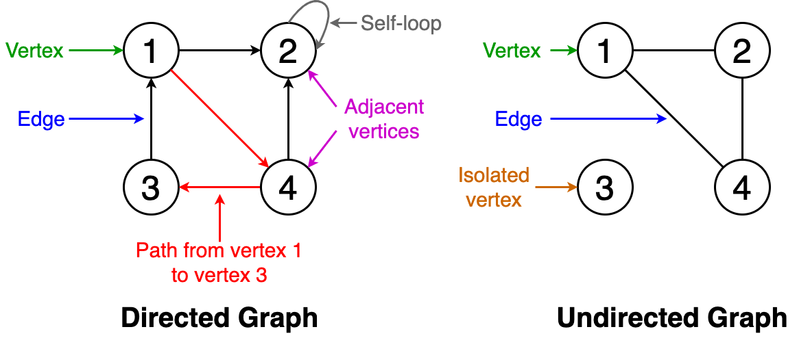

## Graphs

### Basic Definitions of Graphs
- Order: the number of vertices in the graph
- Size: the number of edges in the graph
- Vertex degree: the number of edges that are incident to a vertex
- Isolated vertex: a vertex that is not connected to any other vertices in the graph
- Directed graph: a graph where all the edges have a direction indicating what is the start vertex and what is end vertex
- Undirected graph: a graph with edges that have no direction
- Weighted graph: edges of the graph have weights
- Unweighted graph: edges of the graph have no weights

### Graphs Explanations
- There are no rules regarding the connection among the nodes or vertices in a graph.
- The edges in a graph are the lines that connect each node or vertex. These edges can connect the nodes in any way possible.

#### Two Types of Edges
There are two types of edges: directed and undirected.
- Directed: connections that are one way. One point is the origin and the other point is the end point
- Undirected: connections are two ways.

Directed edges can be represented as an ordered pair, such as (A, B). *A* would be the origin whereas *B* is the destination. Remember that directed edges only go one way, so we do not have a path from B to A; we only have a path from A to B. If we wanted to have a direction from B to A, we would need to add another edge pointing from B to A.

Undirected edges are represented as {A, B}

## Depth First Search
- With this, we use a stack.
    - This stack can either be our own or the call stack via recursion
    - Last In, First Out scenario
- This is all about depth and goes deep
- Its priority is to go deep into its path

#### When To Use It
- Can be used for backtracking, performing a complete search, exhausting every possible path

## Breadth First Search
- With this, we traverse iteratively using a queue
    - First In, First Out
- This is all about breadth and goes *wide*.
- Its priority is to go level by level

#### When To Use It
- Can be used to check if a path exists between each vertex or node, finding distance or levels away from something.
