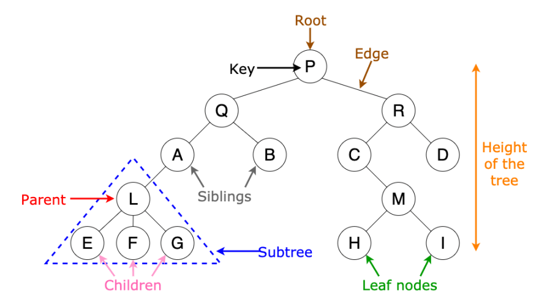
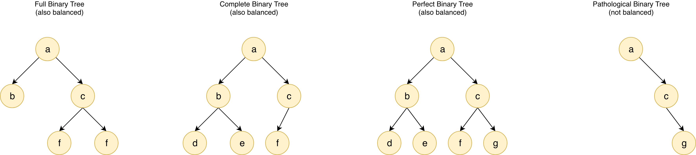
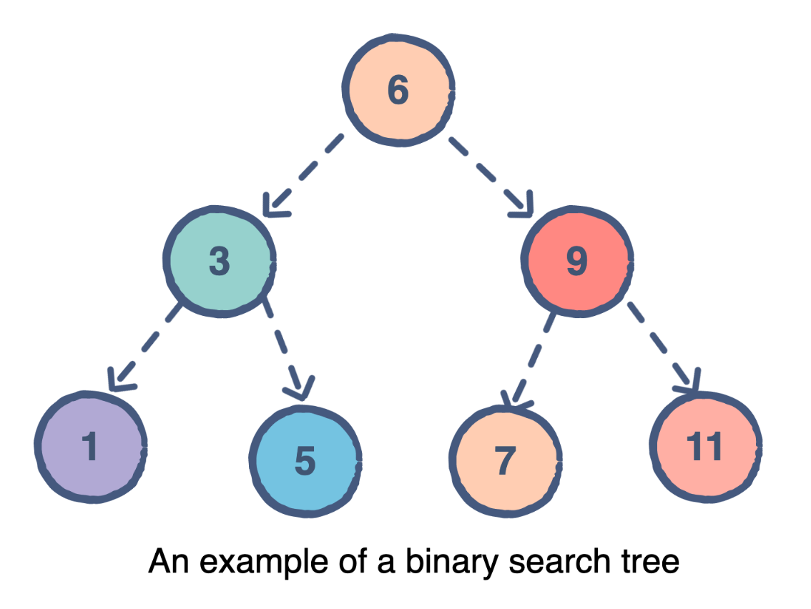

## Trees

### Describe a Tree

- a *full* tree is where a node has NO children or TWO children
    - if it has a descendant, it MUST have TWO of them

- in a *complete* tree (heap), when we fill out a node, we go top to bottom, then left to right

- a *perfect* binary tree is one that is both complete AND also full
    - every node that has descendants or children, have TWO

### Explain the Traversals
- the prefix tells us the order in which we visit the node we're sitting at

#### Pre Order - before we visit the left and right subtree, we visit the node
- Self => Left => Right
- if you need to explore the roots before inspecting any leaves, use pre-order
- you will get all the roots before all of the leaves

#### In Order - we visit the node in the mid of the left and right subtree
- Left => Self => Right
- if you have to flatten the tree back into its original sequence in nodes, use in order.
- this would flatten the tree in the same way it was created

#### Post Order - after we visit the left and right subtree, we visit the node
- Left => Right => Node
- if you need to see all the leaves before any nodes, use post-order
- you don't waste time inspecting roots in search for leaves

#### Pre Order Recursive Traversal

- We start our traversal at Node 6. Node 6 will visit itself and then it's left subtree and right subtree.
    - We're solving this recursively so we won't visit its right subtree until we've gone through its left subtree.
- We visit Node 6 then go to its left subtree, which will take us to Node 3.
- We visit Node 3 then go to its left subtree, which takes us to Node 1.
- Once at Node 1, we visit Node 1, then its left subtree.
    - Node 1 has no left subtree, so we head back to Node 3 and check its right subtree.
    - Node 1 has no right subtree, so we head back up to Node 3
- Once at Node 3, we visit its right subtree. This is because we know Node 3 has visited itself and its left subtree, so all we have left is to visit the right subtree.
- Once at Node 5, we visit Node 5, then its left subtree.
    - Node 5 has no left subtree, so we head back to Node 5 and check its right subtree.
    - Node 5 has no right subtree, so we head back up to Node 6.
- We know Node 6 has visited itself and its left subtree, so we only have to visit its right subtree.
- We visit Node 9 then move to its left subtree.
- Once at Node 7, we visit Node 7, then move to its left subtree.
    - Node 7 has no left subtree, so we head back to Node 7 and check its right subtree
    - Node 7 has no right subtree, so we head back up to Node 9.
- Once at Node 9, we know it has visited itself and its left subtree, so we head to the right subtree.
- Once at Node 11, we visit Node 11, then move to its left subtree
    - Node 11 has no left subtree, so we head back up to Node 11 and visit its right subtree
    - Node 11 has no right subtree, so we head back up to Node 9
- Once we get to Node 9, we have visited the node, its left subtree and its right subtree, so we head back up to Node 6
- We made it back to Node 6, so our job here is done
