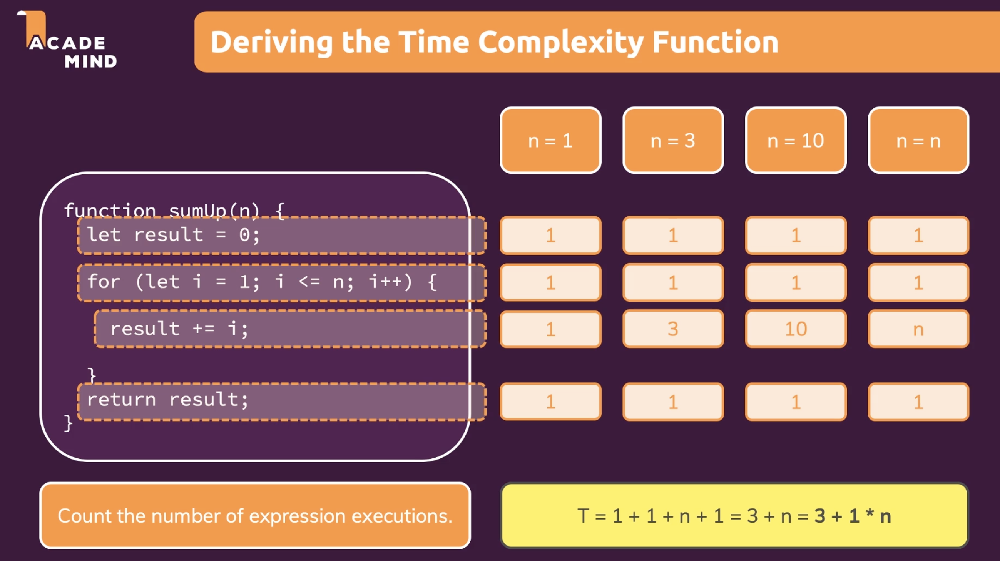
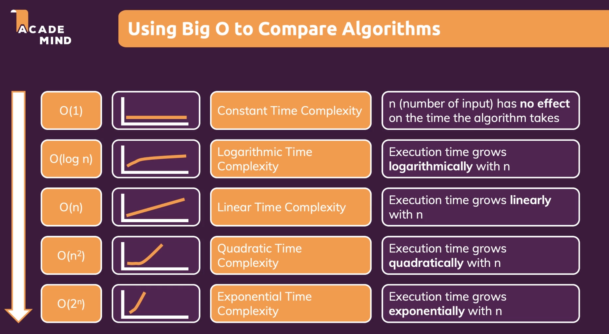

# Big O

[Big O Measuring Performance](https://www.geeksforgeeks.org/understanding-time-complexity-simple-examples/ "Big O Measuring Performance")

## Measuring Performance (Time Complexity)
- **O(n^2)**: You ask the first person of the class if they have the pen, then you ask this person about the other 99 people in the classroom if they have that pen.

- **O(n)**: Going and asking each student individually.

- **O(log n)**: I divide the class into two groups. I ask if the pen is on the left or the right side of the classroom. Then I take that group and divide that group into two and ask again, and so on until I'm left with one person who has the pen.

## Deriving Big O (Asymptotic Analysis)
1. Define the function
    - count the number of expression executions
    - T = a * n + b
2. Find the fasted growing term
    - T = **a*n** + b
3. Remove the coefficient
    - T = n

## Using Big O to Compare Algorithms

## Identifying Big O Quickly
- O(n): Higher n leads to a linear increase in runtime => Look for (single) loops
- O(1): Higher n does not affect runtime => Look for functions without loops and witout any function calls

## Bitwise Operators
![Bitwise Operators][https://www.geeksforgeeks.org/javascript-bitwise-operators/]

![Bitwise Numbers][https://www.khanacademy.org/computing/computers-and-internet/xcae6f4a7ff015e7d:digital-information/xcae6f4a7ff015e7d:binary-numbers/a/bits-and-binary]

### Powers of Two
- 2^2 = 2
- 2^3 = 4
- 2^4 = 8
- 2^5 = 32
- 2^6 = 64
- 2^7 = 128
- 2^8 = 256
